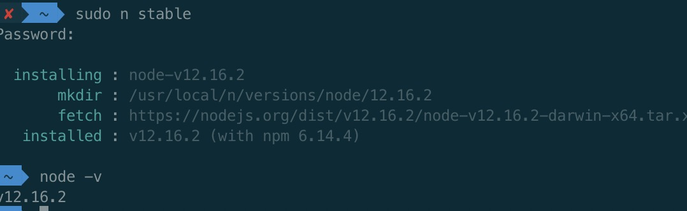

# react 源码阅读

[如何阅读 react 源码（一） · Issue #132 · JesseZhao1990/blog · GitHub](https://github.com/JesseZhao1990/blog/issues/132)

对于 react 这样的巨型项目来说，不了解其设计思路，直接钻到海量代码里，最终的结果就是消磨兴趣，从入门到放弃。我个人觉得阅读大型项目源码的思路应该是首选用 google 搜索一下 react 源码解析。大体了解 react 的设计思路，然后再把源代码克隆下来，通过 readme 了解源码的组织形式，最后亲自 debug。

本文就具体解释一下如何 debug react 的源码。

    1. 首先把react源码克隆到本地。这里有一个小建议，那就是去阅读最新版的代码，因为react最新版本的代码组织结构更清晰，更易读。之前版本用的是gulp和grunt打包工具。仅项目的各种引用关系都理的让人头疼。源码结构可以先读一下官方文档的说明：https://reactjs.org/docs/codebase-overview.html
    2. 利用create-react-app创建一个自己的项目
    3. 把react源码和自己刚刚创建的项目关联起来。到react源码的目录下运行yarn build。这个命令会build源码到build文件夹下面，然后cd到react文件夹下面的build文件夹下。里面有node_modules文件夹，进入此文件夹。发现有react文件夹和react-dom文件夹。分别进入到这两个文件夹。分别运行yarn link。此时创建了两个快捷方式。react和react-dom。
    4. cd到自己项目的目录下，运行yarn link react react-dom 。此时在你项目里就使用了react源码下的build的相关文件。如果你对react源码有修改，经过build之后，就能里面体现在你的项目里。你可以在react源码里打断点，甚至修改react源码。然后在项目里验证你的修改。

调试技巧

    1. 利用浏览器的开发者工具，在适当的地方打断点，进行追踪
    2. 全局搜索大法
    3. 充分利用console.trace，打印出函数的调用栈，分析函数的调用关系

## 一 阅读官方文档

代码库概述：[Codebase Overview – React](https://reactjs.org/docs/codebase-overview.html)
https://reactjs.org/docs/implementation-notes.htmlq

## 二、build

### 升级 node 版本

1. 先清除 npm 缓存：npm cache clean -f
2. 然后安装 n 模块：npm install -g n
3. 升级 node.js 到最新稳定版：n stable
4. 如果是 mac 升级出现错误 在命令前面家 sudo
   

### yarn install

### yarn build

[image:B4FCA39D-3D3C-47FA-957D-DA0861E65528-331-000035ECA3323CB7/54D97933-DCEA-4CE4-B327-00CE8206E145.png]
[image:662A1D3E-9833-46B4-87F3-89AF3EA1EA62-331-000035FFE6A6ED8A/BB0D8FBF-2D59-418C-86E6-9C46DAE0A5A8.png]

## 三、Flow

没装 flow 扩展之前，在打开 flow 文件会这样
[image:C3AE2376-9C48-4DB4-8CA5-6C1777868CEE-331-00003A19B029E687/FB889332-A564-4C98-B208-6649AEFF2399.png]

1. 安装插件 Flow Language Support
2. 搜索 @builtin ，在工作区内禁用 _TypeScript and JavaScript Language Features_
3. 运行 yarn flow-ci
4. 搜索 find . -name ".flowconfig"
   [image:52D435EF-9C7E-40DC-892B-3C9EF271D1F2-331-000039F27149820B/0AD2EF88-A4FA-42D7-8B93-30E4870F0EB3.png]
5. 此时再回到 ReactDOM 就没有红色线了，而且按住 command 也可以正确显示
   [image:13BD21F5-043C-4028-BDB8-455B7DD7E69B-331-000039F6CC07A181/2B125190-03D1-4243-84C0-80ADFD47F7F0.png]

## 四、fiber Reconciler 和 Stack Reconciler

### Stack Reconciler

“堆栈”协调器是为 React 15 及更早版本提供支持的实现。

### fiber Reconciler

fiber Reconciler 是一项新的工作，旨在解决堆叠调节器固有的问题并解决一些长期存在的问题。自从 React 16 以来，它一直是默认的协调器。

其主要目标是：
_ 能够将可中断工作拆分为多个块。
_ 能够对进行中的工作进行优先级排序，变基和重用。
_ 能够在父母和孩子之间来回回荡以支持 React 中的布局。
_ 能够从中返回多个元素 render()。 \* 更好地支持错误边界。
您可以 [在此处](https://github.com/acdlite/react-fiber-architecture) 和 [此处](https://blog.ag-grid.com/inside-fiber-an-in-depth-overview-of-the-new-reconciliation-algorithm-in-react) 阅读有关 React Fiber Architecture 的更多信息。虽然它随 React 16 一起提供，但默认情况下尚未启用异步功能。
其源代码位于中 [packages/react-reconciler](https://github.com/facebook/react/tree/master/packages/react-reconciler) 。

React 如何以及为什么在 Fiber 中使用链表来遍历组件树: ([The how and why on React’s usage of linked list in Fiber to walk the component’s tree](https://medium.com/react-in-depth/the-how-and-why-on-reacts-usage-of-linked-list-in-fiber-67f1014d0eb7))
