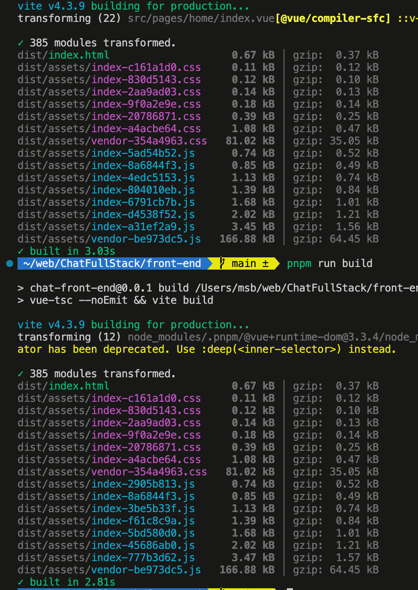
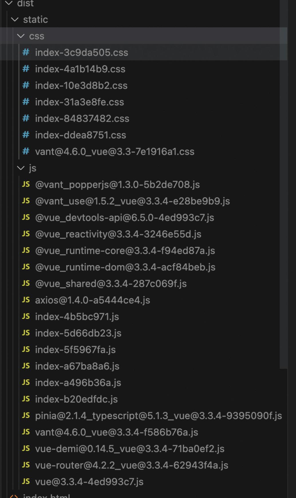
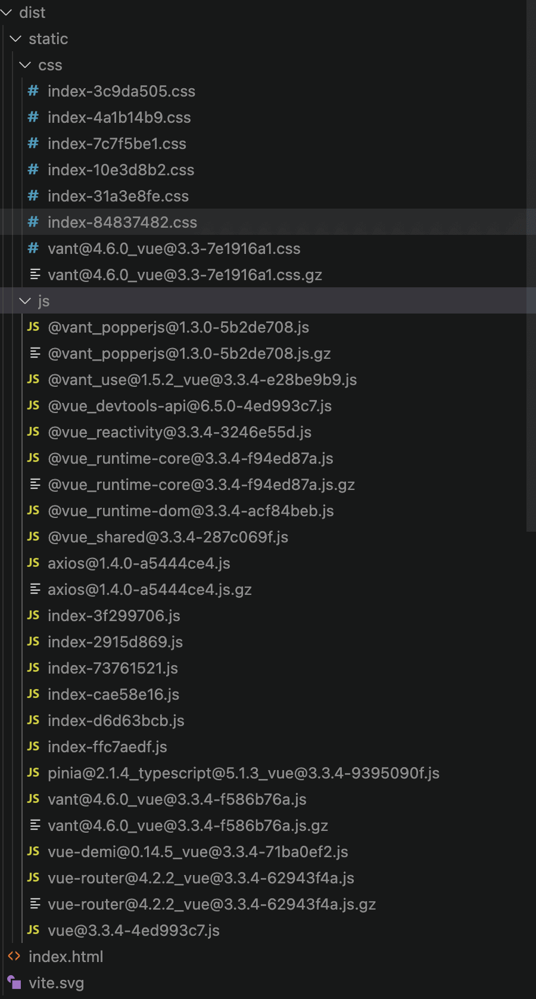
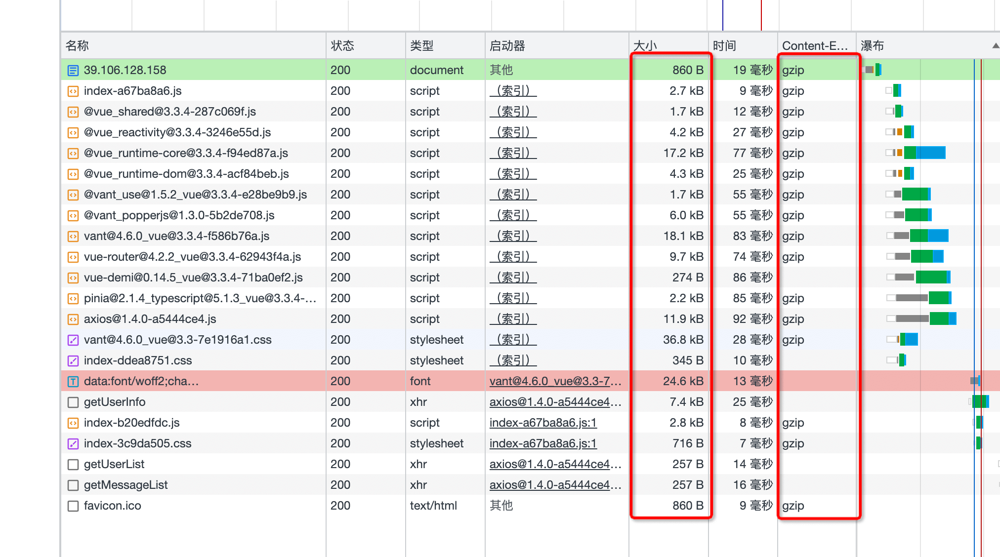

# Vite

## 分包

```js
// vite.config.js
import { defineConfig } from "vite";

export default defineConfig({
  build: {
    rollupOptions: {
      output: {
        manualChunks: (id) => {
          // 1. 这种方式将所有 node_modules 的包放在一个文件夹下，请求数最少，但更新一个会影响到整体 hash
          // return "vendor";
          // 2. 这种将所有的 node_modules 包单独打包，请求数会增多，但好处是单独请求，更新某一个不影响其他的
          return id
            .toString()
            .split("node_modules/.pnpm/")[1]
            .split("/")[0]
            .toString();
        },
      },
    },
  },
});
```

### 第一种

修改后，会将 node_modules 单独打一个包，当修改我们代码内容时，这个包的 hash 不会变

> 更改前，一旦修改，全部都会变，现在最大的这个包不会变了



### 第二种

将所有的 node_modules 包单独打包，请求数会增多，但好处是单独请求，更新某一个不影响其他的



### 路径区分

```js
rollupOptions: {
  output: {
    // 资源 分开放
    chunkFileNames: "static/js/[name]-[hash].js",
    entryFileNames: "static/js/[name]-[hash].js",
    assetFileNames: "static/[ext]/[name]-[hash].[ext]",
  }
}
```

## Gzip

### vite 部分

```sh
pnpm install -D vite-plugin-compression
```

```js
import viteCompression from 'vite-plugin-compression';

plugins: [
  ...
  viteCompression({
    verbose: true, // 是否在控制台输出压缩结果
    disable: false, // 是否禁用,相当于开关在这里
    threshold: 10240, // 体积大于 threshold 才会被压缩,单位 b，1b=8B, 1B=1024KB  那我们这里相当于 9kb多吧，就会压缩
    algorithm: "gzip", // 压缩算法,可选 [ 'gzip' , 'brotliCompress' ,'deflate' , 'deflateRaw']
    ext: ".gz", // 文件后缀
  }),
],

```

### nginx 部分

```nginx
server {
    ...

    gzip on; # 是否开启gzip
    gzip_buffers 32 4K; # 缓冲(压缩在内存中缓冲几块? 每块多大?)
    gzip_comp_level 6; # 推荐6 压缩级别(级别越高,压的越小,越浪费CPU计算资源)
    gzip_min_length 1k; # 开始压缩的最小长度(再小就不要压缩了,意义不在)
    gzip_types application/javascript text/css text/xml; # 对哪些类型的文件用压缩 如txt,xml,html ,css
    gzip_disable "MSIE [1-6]\."; #正则匹配UA，配置禁用gzip条件。此处表示ie6及以下不启用gzip（因为ie低版本不支持）
    gzip_http_version 1.1; # 开始压缩的http协议版本(可以不设置,目前几乎全是1.1协议)
    gzip_vary on; # 是否传输gzip压缩标志

}


```

### 打包



### http 效果



> 1. 已经显示开启 gzip 压缩
> 2. 经过对比，传输的文件大小是打包后压缩后的更小的包 (压缩了 2-3 倍左右)
