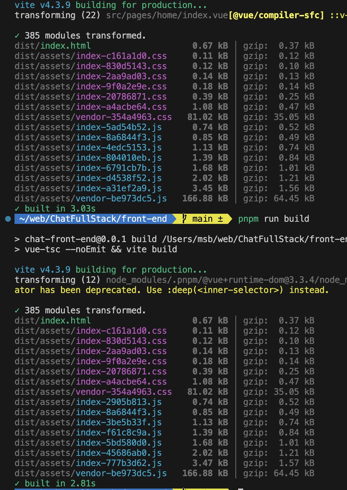

# Vite

## 分包

```js
// vite.config.js
import { defineConfig } from "vite";

export default defineConfig({
  build: {
    rollupOptions: {
      output: {
        manualChunks: (id) => {
          // 将 node_modules 中的代码单独打包成一个 JS 文件
          if (id.includes("node_modules")) {
            return "vendor";
          }
        },
      },
    },
  },
});
```

修改后，会将 node_modules 单独打一个包，当修改我们代码内容时，这个包的 hash 不会变
> 更改前，一旦修改，全部都会变，现在最大的这个包不会变了



## Gzip

需要 nginx 设置, TODO